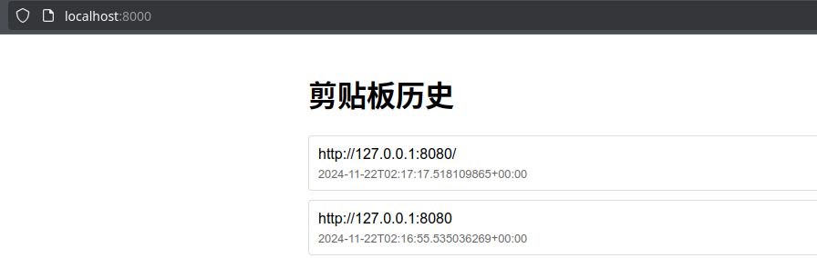

# Clipboard

sync your clipboard to database so you dont lose them by accident. Currently using d1 for prototyping.

```
npx wrangler d1 execute clipboard --remote --file=./schema.sql
```

fill in the token in `.env.in`, rename to `.env`

server.py is used to show history record.

## Result



